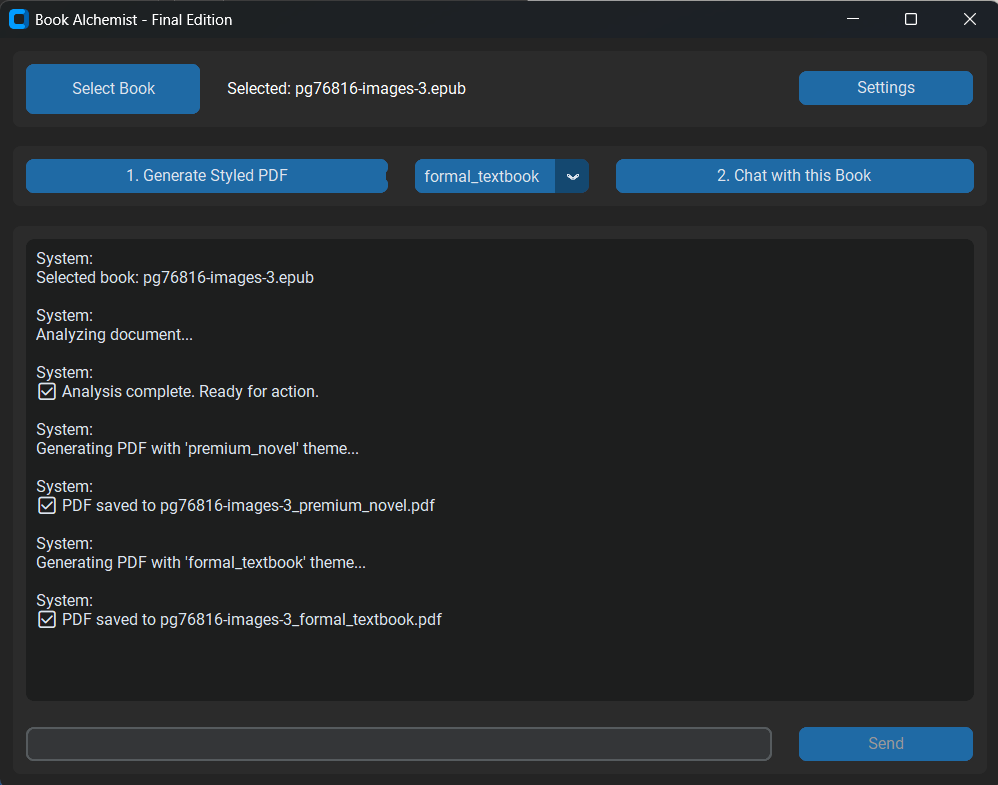
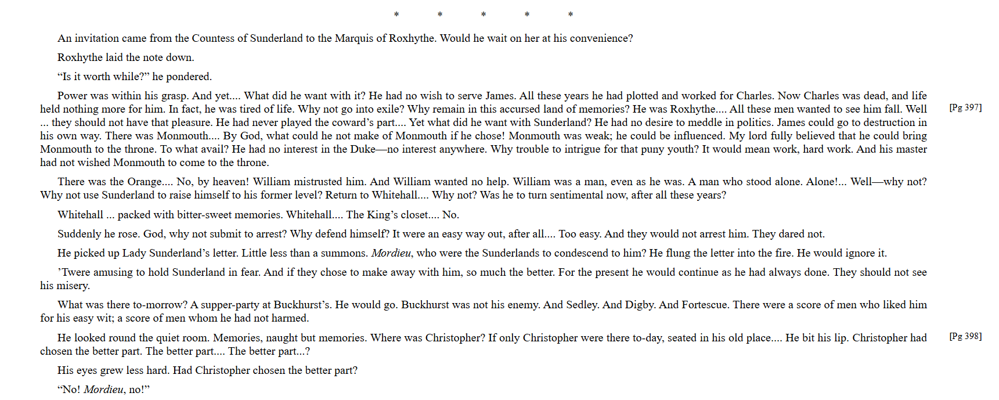
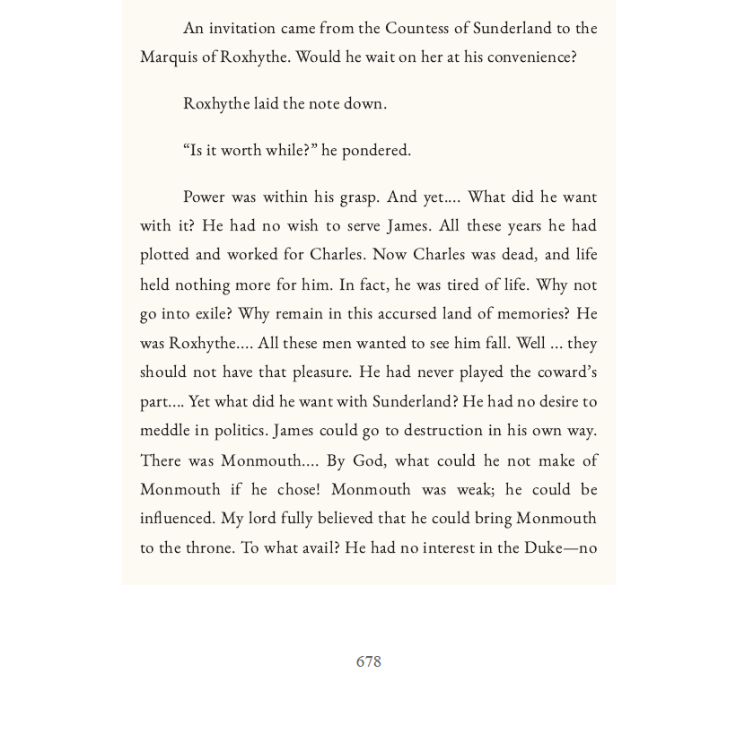

# Book Alchemist 

**Transform any document into a beautiful, intelligent ebook.**

Book Alchemist is a sophisticated desktop application that converts plain documents (PDF, EPUB, MOBI) into exquisitely styled, premium-format ebooks. More than just a styler, it features a powerful, fully offline conversational AI assistant that can answer questions, explain concepts, and discuss themes based on the content of your book.

This project is built with a local-first, privacy-focused philosophy, allowing all core AI functionalities to run on your machine without needing an internet connection.

---

### ✨ Features

*   **Advanced Styling Engine:** Convert unstructured documents into beautifully typeset PDFs using one of two master-class themes:
    *   **Premium Novel:** A theme designed with professional typographic principles, featuring procedural page textures, running headers, and a layout that mimics a high-quality hardbound classic.
    *   **Formal Textbook:** A clean, clear, and professional theme perfect for academic papers, manuals, and technical documents, with special styling for code blocks and images.
*   **Multi-Format Support:** Ingests `.pdf`, `.epub`, and `.mobi` files seamlessly.
*   **Dual-Mode Conversational AI:** Chat with your documents using a powerful Retrieval-Augmented Generation (RAG) pipeline.
    *   **Local AI (Default):** Runs a powerful LLM (Mistral 7B) directly on your machine for a 100% offline and private experience. GPU acceleration via CUDA is supported.
    *   **API Mode (Optional):** Configure the app to use external API providers like OpenAI or Perplexity with your own key.
*   **Semantic Caching:** The AI remembers previously asked questions. Semantically similar queries are answered instantly from a local cache, dramatically boosting speed and reducing redundant computations.
*   **Image & Caption Retention:** Intelligently extracts images and their captions from source documents and preserves them in the final styled output.
*   **Responsive Desktop GUI:** A modern, multi-threaded user interface built with CustomTkinter ensures the app never freezes, even during intensive AI processing.

### 📸 Screenshots

*(It is highly recommended to replace these placeholders with actual screenshots of your application)*


*The main interface after loading a book.*



*An example of the epub input from Project Gutenberg*



*One page of the App processed epub converted to pdf* 

### 🛠️ Technology Stack

*   **Backend:** Python
*   **GUI:** CustomTkinter
*   **Document Parsing:** PyMuPDF (for PDF), EbookLib & BeautifulSoup4 (for EPUB)
*   **Document Conversion:** Calibre Command-Line Tools (for MOBI)
*   **AI Orchestration:** LangChain
*   **Local LLM:** Llama.cpp (running Mistral 7B GGUF)
*   **Vector Database:** ChromaDB
*   **Embedding Models:** Hugging Face Sentence-Transformers
*   **PDF Generation:** Playwright (headless Chromium)

---

### 🚀 Getting Started

Follow these instructions to get Book Alchemist running on your Windows machine.

#### Prerequisites

Before you begin, you must have the following software installed on your system:

1.  **Python 3.11 (64-bit):**
    *   Download from the [official Python website](https://www.python.org/ftp/python/3.11.8/python-3.11.8-amd64.exe).
    *   **CRITICAL:** During installation, make sure to check the box that says **"Add python.exe to PATH"**.

2.  **Git:**
    *   Download from the [official Git website](https://git-scm.com/download/win).

3.  **Calibre:** (Required for `.mobi` file support)
    *   Download from the [official Calibre website](https://calibre-ebook.com/download).
    *   Ensure its installation directory is added to your system's PATH.

4.  **NVIDIA GPU (Recommended):**
    *   For the best performance with the local AI, a modern NVIDIA GPU with at least 4GB of VRAM and up-to-date drivers is strongly recommended.

#### Easy Installation

Once the prerequisites are installed, setting up the application is simple.

1.  **Clone the repository:**
    ```bash
    git clone https://github.com/your-username/BookAlchemist.git
    cd BookAlchemist
    ```

2.  **Run the Installer:**
    *   In the project folder, simply double-click the `install.bat` file.
    *   The script will guide you through the entire setup process, including installing dependencies and downloading the AI model. Please be patient, as some steps (like installing PyTorch) can take several minutes.

### 💻 How to Use

1.  After the installation is complete, double-click the **`run_app.bat`** file in the project folder.
2.  The application will start, pre-load the AI models, and you'll be ready to go!

---

### 📜 License

This project is licensed under the MIT License - see the `LICENSE.md` file for details.
